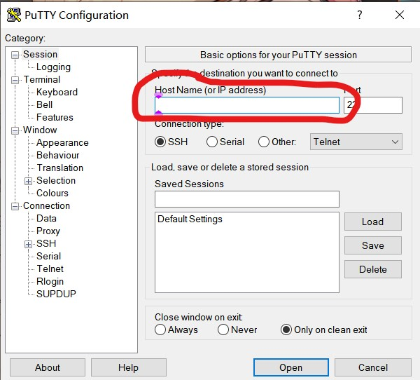
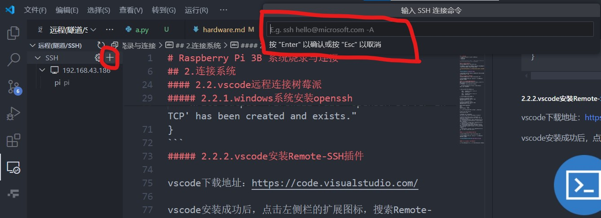

# Raspberry Pi 3B 系统烧录与连接

## 1.烧录系统
使用树莓派官方工具Raspberry Pi Imager，下载地址：https://www.raspberrypi.org/software/

下载成功后，打开Raspberry Pi Imager，选择系统镜像文件，点击写入，等待烧录完成。

## 2.连接系统
使用ssh远程连接树莓派，树莓派用户密码：
- 用户名：pi
- 密码：123

>前提条件：pc与树莓派连接同一局域网，可以都连接手机热点，在手机上可以直接查看树莓派的ip地址。

#### 2.1.putty连接树莓派
putty下载地址：https://www.putty.org/

下载成功后，进入putty，在红色框中输入树莓派的ip地址，点击open，输入用户名和密码，回车键连接。  

**注意：输入密码时不显示任何字符，输入完后点击回车即可**



进入后，可以看到树莓派的命令行界面。绝大多数Linux系统命令都可以在这里执行。

#### 2.2.vscode远程连接树莓派
vscode下载地址：https://code.visualstudio.com/  

vscode安装成功后，点击左侧栏的扩展图标，搜索Remote-SSH，点击安装。

##### 2.2.1.windows系统安装openssh
如果是windows系统，需要安装openssh，才能使用ssh远程连接树莓派。
1. 以管理员形式运行powershell，输入：
```
   Get-WindowsCapability -Online | Where-Object Name -like 'OpenSSH*'
   ```
   
2. 如果未安装，则返回如下结果：
```
    Name  : OpenSSH.Client~~~~0.0.1.0
    State : NotPresent
 
    Name  : OpenSSH.Server~~~~0.0.1.0
    State : NotPresent
   ```
3. 然后根据需要安装对应的服务：
```
# Install the OpenSSH Client
Add-WindowsCapability -Online -Name OpenSSH.Client~~~~0.0.1.0
 
# Install the OpenSSH Server
Add-WindowsCapability -Online -Name OpenSSH.Server~~~~0.0.1.0
 
#两者都会返回下列内容：
Path          :
Online        : True
RestartNeeded : False
```
4. 启动并配置 OpenSSH 服务器，以此执行以下三步：
```
# Start the sshd service
Start-Service sshd
 
# OPTIONAL but recommended:
Set-Service -Name sshd -StartupType 'Automatic'
 
# Confirm the Firewall rule is configured. It should be created automatically by setup. Run the following to verify
if (!(Get-NetFirewallRule -Name "OpenSSH-Server-In-TCP" -ErrorAction SilentlyContinue | Select-Object Name, Enabled)) {
    Write-Output "Firewall Rule 'OpenSSH-Server-In-TCP' does not exist, creating it..."
    New-NetFirewallRule -Name 'OpenSSH-Server-In-TCP' -DisplayName 'OpenSSH Server (sshd)' -Enabled True -Direction Inbound -Protocol TCP -Action Allow -LocalPort 22
} else {
    Write-Output "Firewall rule 'OpenSSH-Server-In-TCP' has been created and exists."
}
```
##### 2.2.2.vscode安装Remote-SSH插件

vscode下载地址：https://code.visualstudio.com/  

vscode安装成功后，点击左侧栏的扩展图标，搜索Remote-SSH，点击安装。


##### 2.2.3.vscode通过ssh连接树莓派

通过点击SSH右边的“+”，进行远程连接，输入命令格式如下：
···
ssh pi@树莓派ip地址
···



